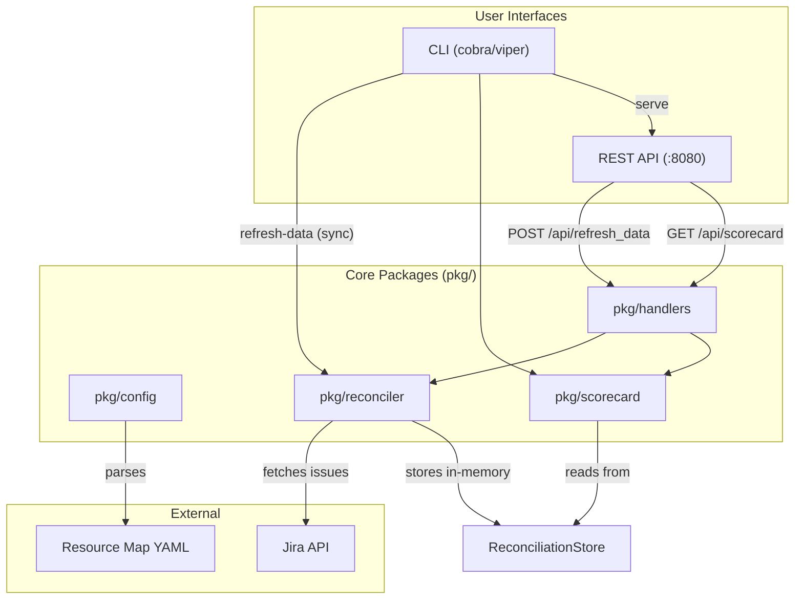
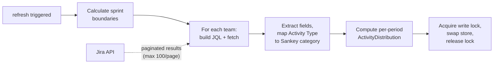

# Sankey Scorecard - Design Document

## Purpose

Sankey Scorecard is a Golang CLI and API tool that evaluates engineering teams on their
adherence to the Sankey planning framework. It does this by fetching Jira issue data,
measuring how consistently teams categorize their work using the Activity Type custom field,
and scoring how well each team's work distribution aligns with target allocations across six
Sankey categories.

The tool produces scorecards at three levels of an organizational hierarchy:
**Organization > Pillar > Team**. Scores range from 0-100 with letter grades (A-F).

---

## System Architecture



The CLI and API are thin layers over shared packages. The CLI invokes the same reconciler
and scorer that the API handlers use. The only behavioral difference is that `refresh-data`
runs synchronously in the CLI and asynchronously behind the API.

---

## Organizational Hierarchy

Teams are organized into a three-level hierarchy defined in the resource map configuration:

- **Organizations** (e.g., Hybrid Cloud Management)
- **Pillars** within organizations (e.g., ROSA, Fleet, ARO)
- **Teams** within pillars (e.g., Aurora, Coffee)

All identifiers across all levels must be globally unique. This allows both the CLI and API
to accept a single identifier without requiring the full path. Slash-delimited paths
(e.g., `rosa/aurora`) are only needed when an identifier is ambiguous.

The resource map also defines how each team claims ownership of Jira issues. Three ownership
methods are supported:

| Method | Identifies issues by | Example from resource map |
|--------|---------------------|--------------------------|
| `component` | Project + component list | `project: ARO, components: [clusters-service, aro-hcp-clusters-service]` |
| `team_field` | Project + Team custom field value | `project: OCM, team_field_value: Coffee` |
| `jql` | Arbitrary JQL query | `project = ACM AND component in ("Application Lifecycle", ...)` |

See @.spec/resource-map-example.yaml for the full configuration structure including sprint
calendar settings, scored issue types, and rate limiting configuration.

---

## Scoring Model

Each team receives a composite score from 0 to 100, computed from two dimensions:

### Dimension 1: Categorization Rate (60 points)

Measures the percentage of scored issues that have the Activity Type field populated. This is
the primary adoption metric and carries the majority weight.

```
score = (categorized_count / total_count) * 60
```

If a team has zero scored issues, the score is `nil` (no data), not zero.

### Dimension 2: Distribution Alignment (40 points)

Measures how closely the team's actual distribution across six Sankey categories matches the
configured target distribution. Only categorized issues are evaluated.

The six categories, ordered by priority:

1. Associate Wellness & Development
2. Incidents & Support
3. Security & Compliance
4. Quality / Stability / Reliability
5. Future Sustainability
6. Product / Portfolio Work

Deviations from target are penalized asymmetrically based on category priority:
over-allocating to high-priority categories incurs less penalty than over-allocating to
low-priority ones. The penalty weight formula is:

```
over_weight(rank)  = 0.5 + (rank - 1) * 0.2
under_weight(rank) = 1.5 - (rank - 1) * 0.2
```

The default target distribution allocates 12% each to the top three categories, 22% to
Quality/Stability, and 21% each to Future Sustainability and Product/Portfolio.

### Grade Scale

| Grade | Score Range |
|-------|------------|
| A | 90-100 |
| B | 75-89 |
| C | 60-74 |
| D | 45-59 |
| F | 0-44 |
| - | nil (no data) |

### Aggregation

Pillar and organization scores are **issue-count-weighted averages** of their children's
scores. Teams with nil scores are excluded from aggregation.

See @.spec/scoring-model.md for the full penalty weight table, worked examples demonstrating
the asymmetric scoring behavior, and all configurable parameters.

---

## Data Flow: Reconciliation Pipeline



### Step 1: Sprint Calendar Calculation

The reconciler computes two scoring periods (current sprint + previous sprint) from
`sprint_reference_date` and `sprint_duration_days`. All boundaries are derived as multiples
of the sprint duration from the reference anchor. No Jira sprint API calls are needed.

Example with reference `2026-02-11`, duration `21`:
- Current sprint: `2026-02-11` to `2026-03-04`
- Previous sprint: `2026-01-21` to `2026-02-11`

### Step 2: Issue Fetching

For each team, for each period, a JQL query is constructed by combining the team's ownership
clause with a date filter. Example for a component-based team:

```
project = ARO AND component in (clusters-service, aro-hcp-clusters-service)
AND issuetype in (Story, Bug, Task)
AND updated >= "2026-02-11" AND updated <= "2026-03-04"
```

Results are paginated (100 per page). Rate limiting is applied between API calls (default
100ms delay, exponential backoff on 429 responses).

### Step 3: Transformation

Each Jira issue is reduced to a minimal `Issue` struct containing only scoring-relevant
fields: key, project, issue type, activity type, status, components, summary, and dates.
The Activity Type value is read from a runtime-configured custom field ID
(`--activity-type-field`).

### Step 4: Storage

After all teams are fetched successfully, the entire store is swapped atomically under a
write lock. Partial updates are never applied -- if any team fails, the refresh fails
entirely and previously reconciled data is preserved.

See @.spec/reconciliation-data-model.md for the full Go struct definitions
(`ReconciliationStore`, `TeamData`, `ScoringPeriod`, `Issue`, `ActivityDistribution`),
the concurrency model (RWMutex), and error handling details.

---

## API

The REST API is a JSON API served under the `/api` prefix (leaving `/` free for a future
Web UI). Five endpoints:

| Method | Path | Description |
|--------|------|-------------|
| `GET` | `/api/` | Returns the OpenAPI spec |
| `GET` | `/api/scorecard` | Returns scorecards, with optional `org`, `pillar`, `team` query params |
| `POST` | `/api/refresh_data` | Initiates async Jira reconciliation (returns 202) |
| `GET` | `/api/refresh_status` | Returns reconciliation status (idle/running/completed/failed) |

The scorecard endpoint uses independent query parameters (`?org=hcm`, `?pillar=rosa`,
`?team=aurora`) rather than path segments. Parameters can be combined for disambiguation.
When an identifier matches multiple entities, the API returns HTTP 409 with disambiguation
instructions.

Error responses use a consistent `{ "error": "...", "message": "..." }` structure with
appropriate HTTP status codes (400, 404, 409, 503).

See @.spec/openapi.yaml for the full OpenAPI 3.0.3 specification including all schemas
(`FullScorecard`, `Score`, `PeriodScore`, `ActivityDistribution`, `RefreshStatus`).

---

## CLI

Built with Cobra and Viper. The command structure:

```
sankey-scorecard <identifier>      Show scorecard (plaintext/json/yaml via -o flag)
sankey-scorecard refresh-data      Fetch Jira data synchronously
sankey-scorecard serve             Start the API server
sankey-scorecard version           Print version info
```

Key flags:

| Flag | Scope | Purpose |
|------|-------|---------|
| `-c, --config` | Global | Path to resource map YAML (default: embedded in binary) |
| `-o, --output` | `<identifier>` | Output format: `plaintext`, `json`, `yaml` |
| `--jira-url` | `refresh-data`, `serve` | Jira instance URL |
| `--jira-pat` | `refresh-data`, `serve` | Jira Personal Access Token |
| `--activity-type-field` | `refresh-data`, `serve` | Custom field ID for Activity Type |
| `--since` | `refresh-data` | Override sprint calendar with a custom start date |
| `--bind-address` | `serve` | Server listen address (default `:8080`) |

Exit codes: 0 (success), 1 (general error), 2 (identifier not found), 3 (no data available).

The resource map YAML is embedded in the binary at build time using Go's `embed` package.
The `--config` flag overrides the embedded map entirely.

See @.spec/cli.md for full help text examples and implementation notes on identifier
resolution.

---

## Scorecard Output Model

The scorecard response is hierarchical: `FullScorecard > OrganizationScore > PillarScore >
TeamScore`. Each level carries a `Score` object with:

```json
{
  "total": 72.5,
  "grade": "C",
  "categorization_rate": 45.0,
  "distribution_alignment": 27.5,
  "issue_count": 47
}
```

Nullable score fields (`total`, `categorization_rate`, `distribution_alignment`) serialize as
`null` when a team has zero scored issues, distinguishing "no data" from "scored 0."

Teams include per-sprint breakdowns in a `periods` array, allowing trend analysis across
sprints. The `ActivityDistribution` (issue counts per Sankey category) is present only at the
team level.

The CLI plaintext format renders a human-readable table:

```
ROSA Scorecard
Generated: 2026-02-07 14:30 UTC | Issues: 523

Pillar Score: 71.0 (C)
  Categorization Rate:      43.2 / 60
  Distribution Alignment:   27.8 / 40

Teams:
  TEAM                  SCORE  GRADE  ISSUES  CAT.RATE  DIST.ALIGN
  rosa-coffee            82.5  B          89     50.4      32.1
  rosa-aurora            72.5  C          47     45.0      27.5
```

See @.spec/scorecard-data-model.md for full Go struct definitions, JSON response examples
(including the no-data case), and the complete CLI output format for team-level views with
sprint breakdowns.

---

## Package Layout

```
sankey-scorecard/
  cmd/                          CLI entry point (thin layer, minimal logic)
  config/
    resource-map.yaml           Embedded resource map
  pkg/
    config/                     Configuration parsing and validation
    handlers/                   HTTP handler functions
    reconciler/
      store.go                  ReconciliationStore, state management, RWMutex locking
      reconciler.go             Jira fetch logic, pagination, retry, rate limiting
      sprint.go                 Sprint calendar calculation from reference date
      types.go                  Issue, TeamData, ScoringPeriod, TimeWindow, ActivityDistribution
    scorecard/
      scorecard.go              Score computation, aggregation, grade assignment
      types.go                  FullScorecard, OrganizationScore, PillarScore, TeamScore, Score
      presenter.go              JSON serialization, plaintext/YAML table formatting
  tests/                        Integration tests (ginkgo)
  Makefile
```

---

## Configuration

Three categories of configuration exist:

### 1. Resource Map (YAML file, embedded at build time)

Defines the organizational hierarchy, team ownership rules, sprint calendar, scoring
parameters (target distribution, priority weights, scored issue types), and rate limiting.

See @.spec/resource-map-example.yaml for the full structure.

### 2. Runtime Flags (CLI)

Sensitive or instance-specific values provided at invocation:

- `--jira-url` -- Jira instance URL
- `--jira-pat` -- Personal Access Token (authentication)
- `--activity-type-field` -- Custom field ID for Activity Type (same across the entire
  Jira instance, but varies between instances)

### 3. Build-time

- The resource map YAML is embedded using Go's `embed` package
- Version, commit hash, and build date are injected via `-ldflags`

---

## Testing Strategy

Integration tests live under `tests/` and use the Ginkgo framework.

### Jira Mock Server

A mock Jira server is created for integration tests. Mock data is maintained in YAML files,
following the pattern used by
[go-jira/testing/mock-data](https://github.com/andygrunwald/go-jira/tree/main/testing/mock-data).
This makes test data easy to read and maintain without writing Go structs for every fixture.

### Coverage

Coverage must be reported on every test run. The test suite is considered a **failure** if
coverage drops below 80%.

### Scope

- The CLI layer (`cmd/`) is **not** tested directly
- API handlers and all `pkg/` packages are tested
- Integration tests exercise the full pipeline: mock Jira -> reconciler -> scorer -> API response

### Makefile Targets

| Target | Description |
|--------|-------------|
| `build` | `go build` to project root |
| `install` | `go install` |
| `test` | Unit tests only |
| `test-integration` | Integration tests only |
| `lint` | Run linter |
| `test-all` | All tests including linter |

---

## Technical Requirements

- **Language**: Go
- **Jira SDK**: `github.com/andygrunwald/go-jira/v2` -- selected because it supports both
  Jira Cloud and Server/Data Center via dedicated `cloud` and `onpremise` packages.
  Custom field access uses the `Unknowns` map (raw `interface{}`), requiring a small
  internal helper for Activity Type extraction.
- **Authentication**: Jira PAT (Personal Access Token) provided via `--jira-pat` flag
- **Jira compatibility**: Must support both Jira Cloud and hosted Jira instances
- **CLI framework**: Cobra + Viper
- **Test framework**: Ginkgo
- **Linter**: Industry-standard Go linter with default configuration

---

## Known Limitations & Deferred Items

These are acknowledged gaps documented in @potential-issues.md that are intentionally
deferred from the initial implementation.

| Item | Summary | Status |
|------|---------|--------|
| **API Authentication** | No auth on the API. Acceptable for internal/dev use; revisit if deployed as a shared service. | Deferred |
| **In-Memory Storage Volatility** | All data is lost on process restart. No file-based fallback or auto-refresh on startup. | Deferred |
| **Concurrent Refresh Races** | `POST /api/refresh_data` rejects concurrent requests with HTTP 409. A TOCTOU (Time-of-Check to Time-of-Use) race exists between checking and starting, but this is not expected to be hit at current scale. | Deferred |
| **Story Points vs. Issue Counts** | Scoring uses issue counts. Story point weighting may be added later but requires handling inconsistent/missing data across teams. | Deferred |
| **`types: [main]` Teams** | Some teams in org data reference dashboards rather than projects/components. These teams are unscorable until their resource map entries are corrected. | Deferred |
| **Teams Without Queryable Data** | Teams with only dashboard URLs and no ownership rules should be validated at startup, reported, and excluded from scoring without failing the refresh. | Deferred |
